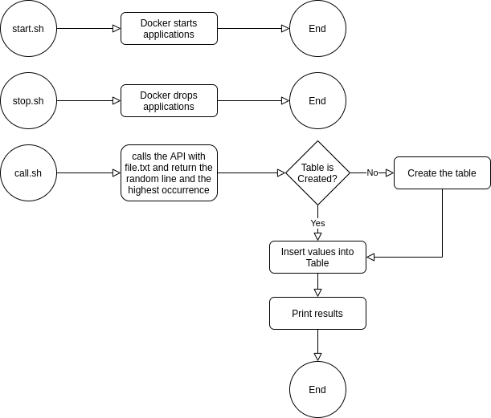

# django-read-file

### Requirements:
- linux operating system. I used Ubuntu 20
- [jq](https://stedolan.github.io/jq/download/) (`sudo apt-get install jq`)
- [docker](https://docs.docker.com/engine/install/)
- [docker-compose](https://docs.docker.com/compose/install/#install-compose-on-linux-systems)

### Details:
This project was quite challenging. Especially when it comes to the script, as it was a long time since I needed to create scripts with so much functionality. Usually I use it only for what I did in the start.sh and stop.sh files.

As explained in the flow in the following topic, I decided to create 3 files:
- start.sh: this file is for starting the API and database containers. It can be executed with the ./start.sh command from the application's root folder.
- stop.sh: this file is for closing previously started containers. It can be executed with the ./stop.sh command from the application's root folder.
- call.sh: this file is for executing the flow itself. It will call the API by passing the file.txt file that is at the root of the project. This call will return a random line from the past file and also the character that is most repeated on that line. After the result of this query, connect the bank container via the command line by executing a table creation script (when it does not exist) and inserting this value. It can be executed with the command ./call.sh from the application's root folder.
### Flow:
